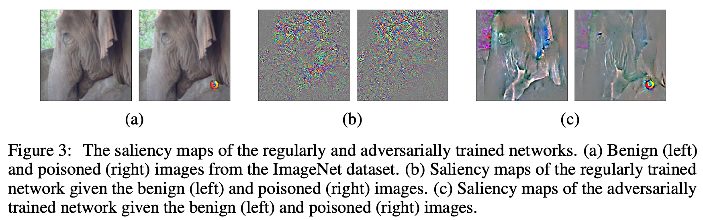

# On the Trade-off between Adversarial and Backdoor Robustness
This is the repository for the paper __On the Trade-off between Adversarial and Backdoor Robustness__, by Cheng-Hsin Weng
, Yan-Ting Lee, and Shan-Hung Wu, published in the Proceedings of NeurIPS 2020. Our code is implemented in TensorFlow.

In this paper, we conduct experiments to study whether adversarial robustness and backdoor robustness can affect each other and find a trade-off — by increasing the robustness of a network to adversarial examples, the network becomes more vulnerable to backdoor attacks. 



## Installation
Clone and install requirements.
```bash
git clone https://github.com/nthu-datalab/On.the.Trade-off.between.Adversarial.and.Backdoor.Robustness
cd On.the.Trade-off.between.Adversarial.and.Backdoor.Robustness
pip install -r requirements.txt
```

## Table 1(a) ##
The trade-off between adversarial and backdoor robustness given different defenses against adversarial attacks - **Adversarial training and its enhancements**.

<table>
<tr align="center" style="font-weight:bold">
<td> Dataset </td>
<td> Adv. Defense </td>
<td> Accuracy </td>
<td> Adv. Roubustness </td>
<td> Backdoor Success rate </td>
</tr>
<tr align="center">
<td rowspan = "6"> MNIST </td>
<td> None (Std. Training) </td>
<td> 99.1% </td>
<td> 0.0% </td>
<td> 17.2% </td>
</tr>
<tr align="center">
<td> Adv. Training </td>
<td> 98.8% </td>
<td> 93.4% </td>
<td> 67.2% </td>
</tr align="center">
<tr align="center">
<td> Lipschitz Reg. </td>
<td> 99.3% </td>
<td> 0.0% </td>
<td> 5.7% </td>
</tr>
<tr align="center">
<td> Lipschitz Reg. + Adv. Training </td>
<td> 98.7% </td>
<td> 93.6% </td>
<td> 52.1% </td>
</tr>
<tr align="center">
<td> Denoising Layer </td>
<td> 96.9% </td>
<td> 0.0% </td>
<td> 9.6% </td>
</tr>
<tr align="center">
<td> Denoising Layer + Adv. Training </td>
<td> 98.3% </td>
<td> 90.6% </td>
<td> 20.8% </td>
</tr>
<tr align="center">
<td rowspan = "6"> CIFAR10 </td>
<td> None (Std. Training) </td>
<td> 90.0% </td>
<td> 0.0% </td>
<td> 64.1% </td>
</tr>
<tr align="center">
<td> Adv. Training </td>
<td> 79.3% </td>
<td> 48.9% </td>
<td> 99.9% </td>
</tr>
<tr align="center">
<td> Lipschitz Reg. </td>
<td> 88.2% </td>
<td> 0.0% </td>
<td> 75.6% </td>
</tr>
<tr align="center">
<td> Lipschitz Reg. + Adv. Training </td>
<td> 79.3% </td>
<td> 48.5% </td>
<td> 99.5% </td>
</tr>
<tr align="center">
<td> Denoising Layer </td>
<td> 90.8% </td>
<td> 0.0% </td>
<td> 99.6% </td>
</tr>
<tr align="center">
<td> Denoising Layer + Adv. Training </td>
<td> 79.4% </td>
<td> 49.0% </td>
<td> 100.0% </td>
</tr>
<tr align="center">
<td rowspan = "4"> ImageNet </td>
<td> None (Std. Training) </td>
<td> 72.4% </td>
<td> 0.1% </td>
<td> 3.9% </td>
</tr>
<tr align="center">
<td> Adv. Training </td>
<td> 55.5% </td>
<td> 18.4% </td>
<td> 65.4% </td>
</tr>
<tr align="center">
<td> Denoising Layer </td>
<td> 71.9% </td>
<td> 0.1% </td>
<td> 6.9% </td>
</tr>
<tr align="center">
<td> Denoising Layer + Adv. Training </td>
<td> 55.6% </td>
<td> 18.1% </td>
<td> 68.0% </td>
</tr>
</table>

## Table 1(b) ##
The trade-off between adversarial and backdoor robustness given different defenses against adversarial attacks - **Certified robustness**

<table>
<tr align="center" style="font-weight:bold">
<td> Dataset </td>
<td> Poisoned Data Rate </td>
<td> Adv. Defense </td>
<td> Accuracy </td>
<td> Certified Robustness </td>
<td> Adv. Roubustness </td>
<td> Backdoor Success rate </td>
</tr>
<tr align="center">
<td rowspan = "2"> MNIST </td>
<td rowspan = "2"> 5% </td>
<td> None </td>
<td> 99.4% </td>
<td> N/A </td>
<td> 0.0% </td>
<td> 36.3% </td>
</tr>
<tr align="center">
<td> IBP </td>
<td> 97.5% </td>
<td> 84.1% </td>
<td> 94.6% </td>
<td> 92.4% </td>
</tr>
<tr align="center">
<td rowspan = "4"> CIFAR10 </td>
<td rowspan = "2"> 5% </td>
<td> None </td>
<td> 87.9% </td>
<td> N/A </td>
<td> 0.0% </td>
<td> 99.9% </td>
</tr>
<tr align="center">
<td> IBP </td>
<td> 47.7% </td>
<td> 24.0% </td>
<td> 35.3% </td>
<td> 100.0% </td>
</tr>
<tr align="center">
<td rowspan = "2"> 0.5% </td>
<td> None </td>
<td> 88.7% </td>
<td> N/A </td>
<td> 0.0% </td>
<td> 81.8% </td>
</tr>
<tr align="center">
<td> IBP </td>
<td> 50.8% </td>
<td> 25.8% </td>
<td> 35.7% </td>
<td> 100.0% </td>
</tr>
</table>

## Table 3 (a)(b) ##
he performance of the pre-training backdoor defenses that detect and remove poisoned training data.

<table>
<tr align="center" style="font-weight:bold">
<td rowspan="2"> Dataset </td>
<td rowspan="2"> Adv. Defense </td>
<td colspan="3"> Detection Rate (Spectral signatures) </td>
<td colspan="3"> Detection Rate (Activation Clustering) </td>
</tr>
<tr>
<td> 5% </td>
<td> 1% </td>
<td> 0.5% </td>
<td> 5% </td>
<td> 1% </td>
<td> 0.5% </td>
</tr>
<tr align="center">
<td rowspan = "2"> CIFAR10 </td>
<td> Dirty-Label Sticker + Std. Training </td>
<td> 81.6% </td>
<td> 24.4% </td>
<td> 2.4% </td>
<td> 100% </td>
<td> 100% </td>
<td> 5.58% </td>
</tr>
<tr align="center">
<td> Clean-Label Sticker + Adv. Training </td>
<td> 50.1% </td>
<td> 10.6% </td>
<td> 5.2% </td>
<td> 48.2% </td>
<td> 9.59% </td>
<td> 5.01% </td>
</tr>
<tr align="center">
<td rowspan = "2"> ImageNet </td>
<td> Dirty-Label Sticker + Std. Training </td>
<td> 100% </td>
<td> 84.6% </td>
<td> 100% </td>
<td> 100% </td>
<td> 100% </td>
<td> 100% </td>
</tr>
<tr align="center">
<td> Clean-Label Sticker + Adv. Training </td>
<td> 50.5% </td>
<td> 13.1% </td>
<td> 9.23% </td>
<td> 47.8% </td>
<td> 9.67% </td>
<td> 3.72% </td>
</tr>
</table>

## Table 3 \(c\) ##
The performance of the post-training backdoor defense that **cleanses neurons**.

<table>
<tr align="center" style="font-weight:bold">
<td> Dataset </td>
<td> Trigger Type </td>
<td> Trigger Label </td>
<td> Training Algorithm </td>
<td> Success rate w/o Defense </td>
<td> Success rate w/ Defense </td>
</tr>
<tr align="center">
<td rowspan = "4"> CIFAR10 </td>
<td rowspan = "2"> Sticker </td>
<td> Dirty </td>
<td> Std. Training </td>
<td> 100% </td>
<td> 0.1% </td>
</tr>
<tr align="center">
<td> Clean </td>
<td> Adv. Training </td>
<td> 99.9% </td>
<td> 0% </td>
</tr>
<tr align="center">
<td rowspan = "2"> Watermark </td>
<td> Dirty </td>
<td> Std. Training </td>
<td> 99.7% </td>
<td> 39.3% </td>
</tr>
<tr align="center">
<td> Clean </td>
<td> Adv. Training </td>
<td> 92.7% </td>
<td> 1.2% </td>
</tr>
<tr align="center">
<td rowspan = "4"> ImageNet </td>
<td rowspan = "2"> Sticker </td>
<td> Dirty </td>
<td> Std. Training </td>
<td> 98.1% </td>
<td> 2.3% </td>
</tr>
<tr align="center">
<td> Clean </td>
<td> Adv. Training </td>
<td> 65.4% </td>
<td> 1.1% </td>
</tr>
<tr align="center">
<td rowspan = "2"> Watermark </td>
<td> Dirty </td>
<td> Std. Training </td>
<td> 96.3% </td>
<td> 39.8% </td>
</tr>
<tr align="center">
<td> Clean </td>
<td> Adv. Training </td>
<td> 49.7% </td>
<td> 4.0% </td>
</tr>
</table>

